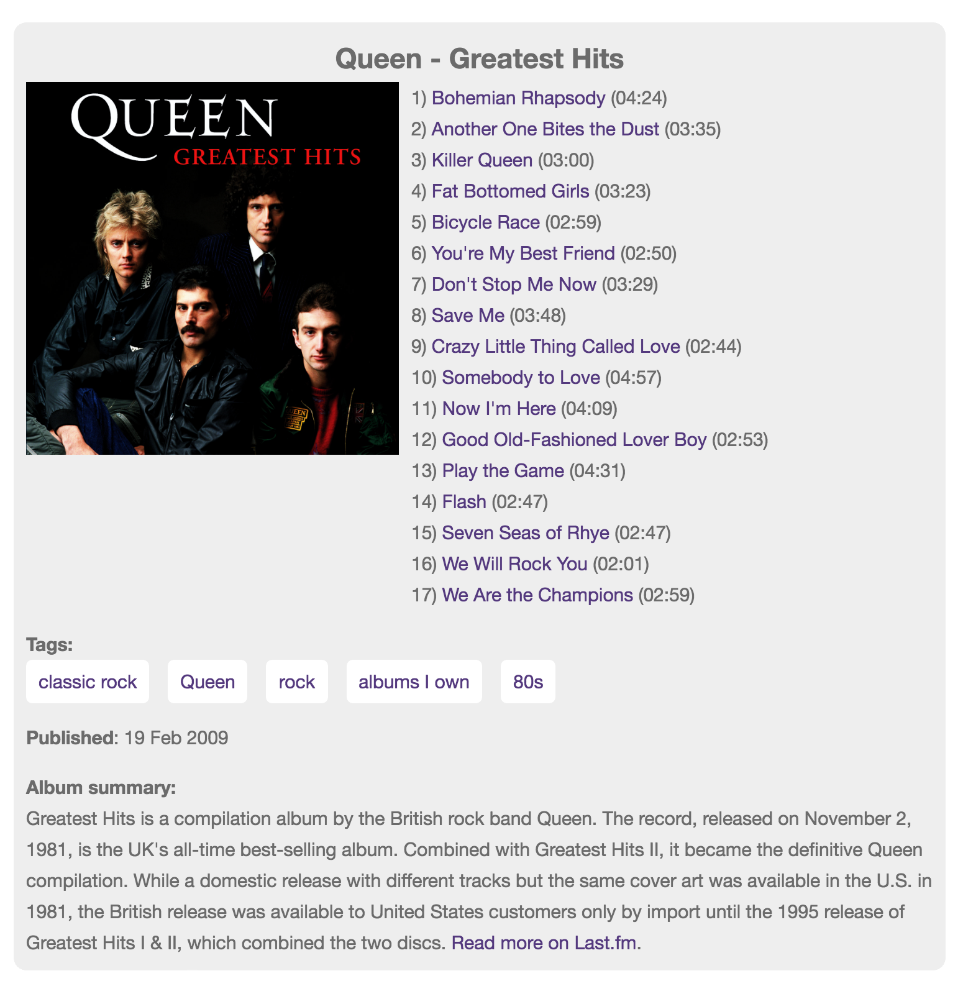

# F13Devs WordPress Last.fm Album Shortcode
Add information to you blog about a musical album using shortcode.

## About
* Developer: [F13Dev](http://f13dev.com)
* Tags: lastfm, last.fm, shortcode, album, information, music, tracklisting, cd
* Requires: WordPress 3.0.1 and up
* Tested to: WordPress 4.5.3
* License: [GPLv3 or later](http://www.gnu.org/licenses/gpl-3.0.html)

## Description
If you blog about music and wish to add information about the album you are viewing without having to source details such as album art, track listings or an album summary, why not use shortcode to do the hard work for you.

Simply install the plugin, add a Last.fm API Token by following the instructions on the admin page and add the shortcode [album artist="anArtist" album="anAlbum"] to insert an array of information about the given album.

Features include:

* Cached using Transient
* Styles appearance
* Includes an image of the album artwork if it is available
* Album artwork is copied to the Media Library to ensure the image is always available when needed
* Provides a list of tracks with the track duration
* Shows a list of tags, such as Genres and 'Albums I own' if the album is marked as owned in the Last.fm account associated with the API key
* Provides a publish date, althogh this may be the publish date of a re-mastered edition
* Displays a summary of the album as provided by the Last.fm API

## Installation
1. Upload the plugin files to the `/wp-content/plugins/plugin-name` directory, or install the plugin through the WordPress plugins screen directly.
2. Activate the plugin through the 'Plugins' screen in WordPress
3. Follow the instructions in 'WPAdmin => Settings => F13 Last.fm Album Shortcode' to obtain a Last.fm API key
3. Add the shortcode [album artist="anArtist" album="anAlbum"] to the desired location
4. If desired, add a cache timeout on the admin page 'Settings->F13 Last.fm Album Shotcode'

## Frequently Asked Questions
Q) Is an API token required

A) Yes, a Last.fm API token is required in order for this plugin to work, instructions for obtaining an API token are details on the plugins admin page.

## Screenshots

An example showing the results of the shortcode [album artist="Queen" album="Greatest Hits"]

## Changelog

### 1.0
* Initial release
